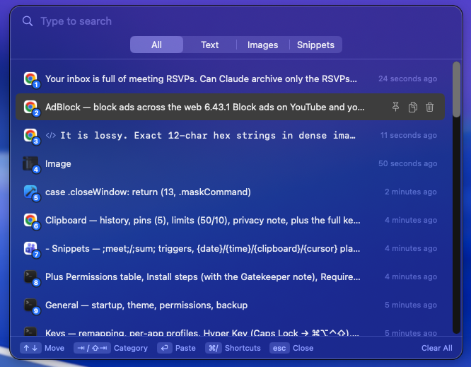
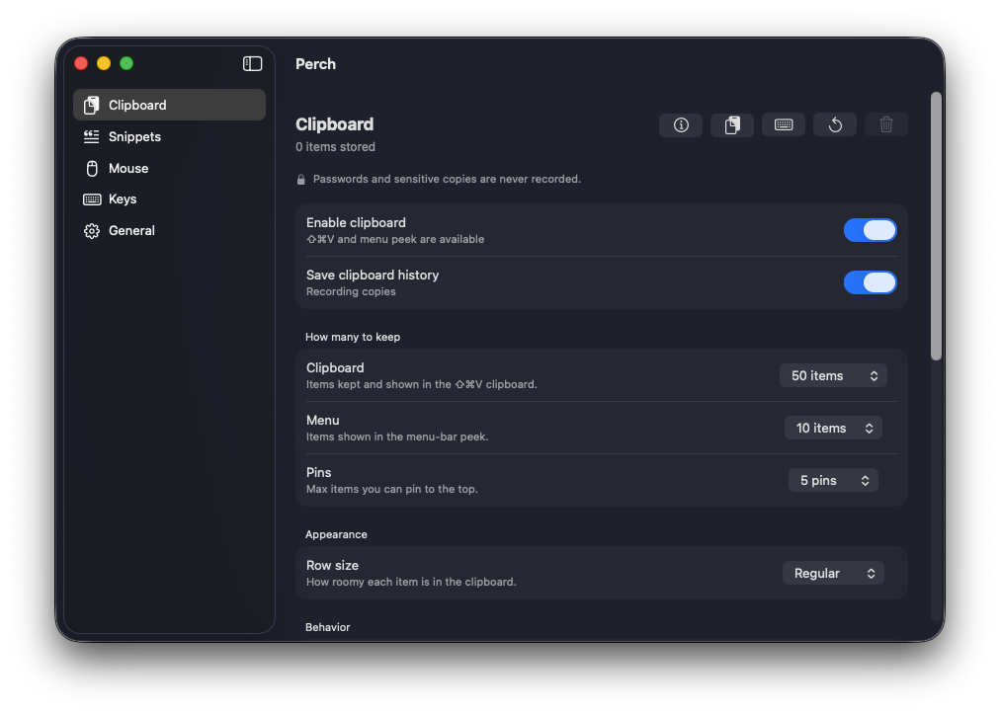
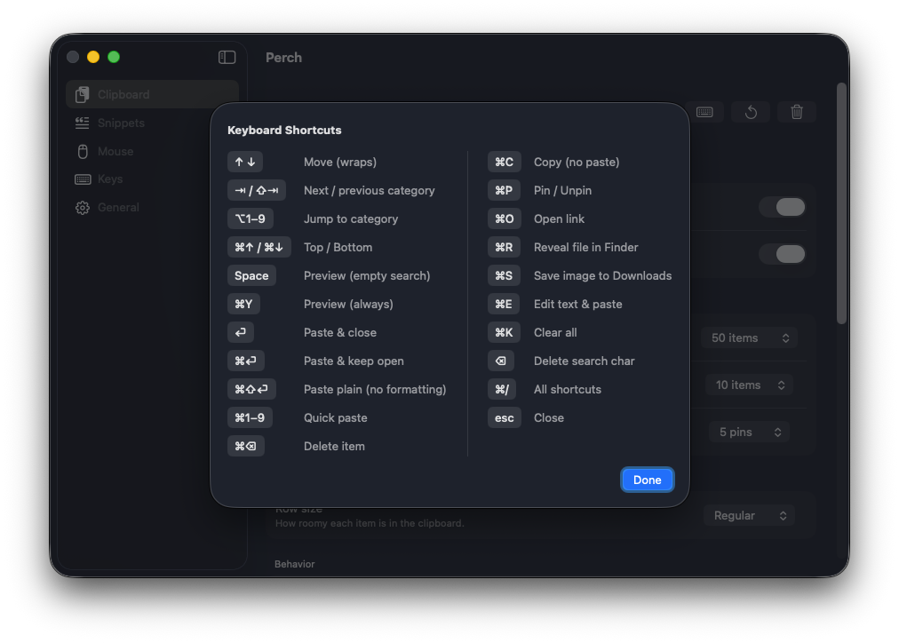
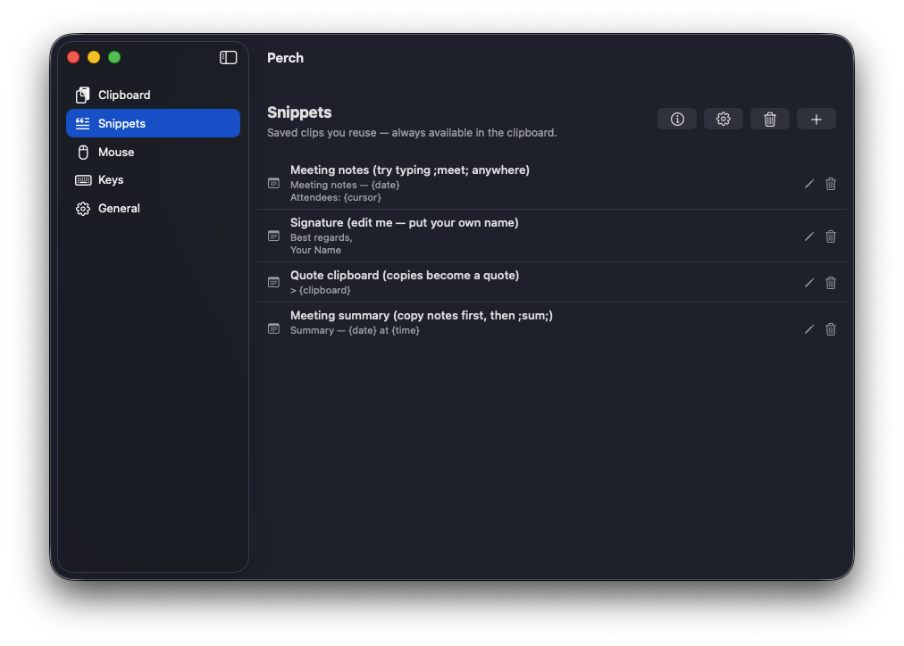
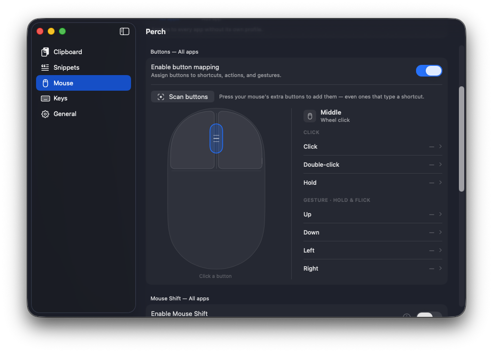
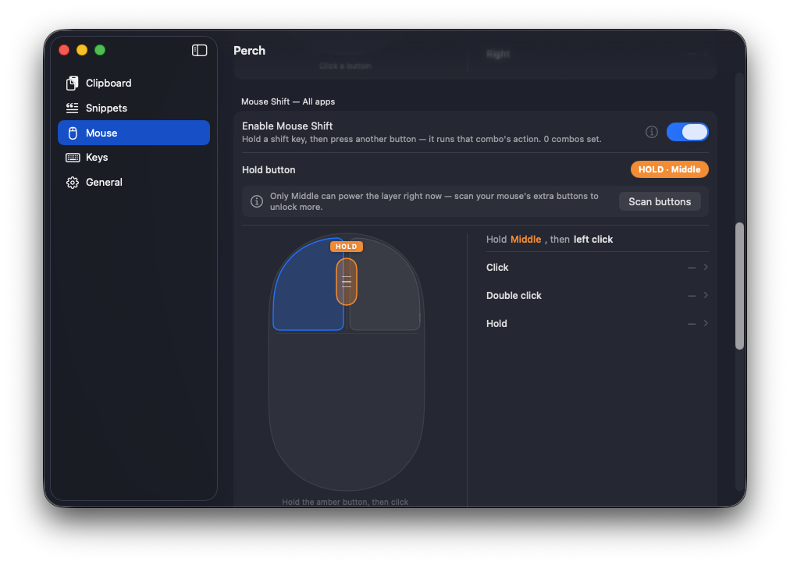
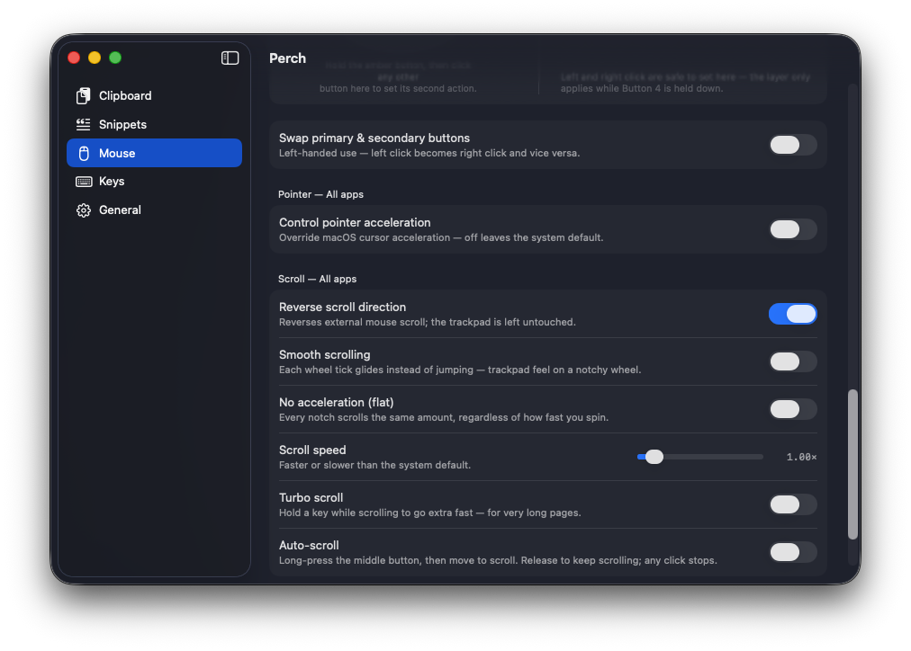
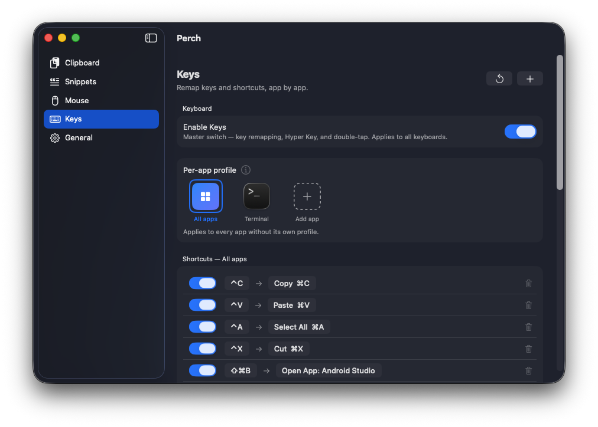
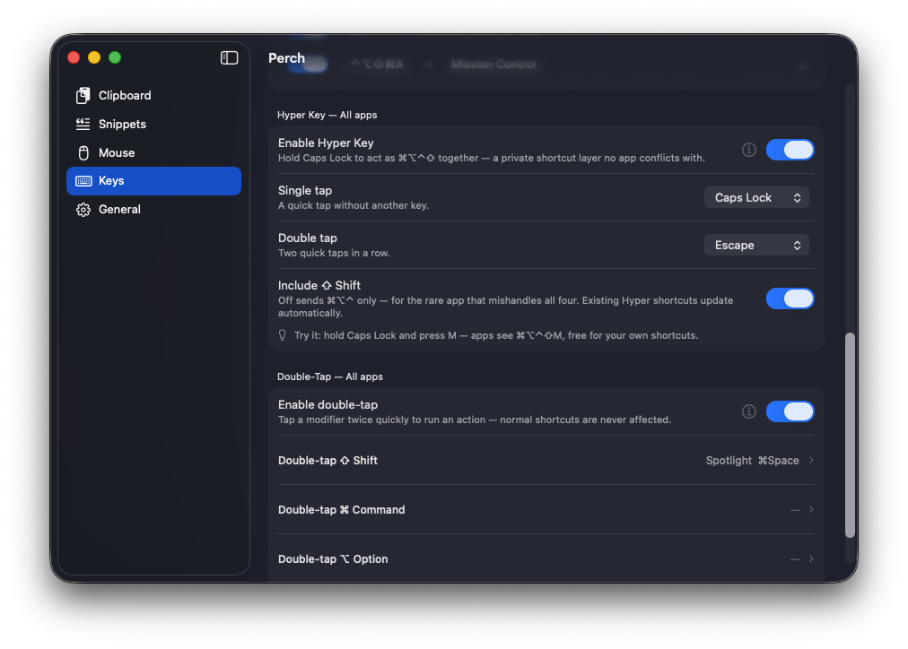
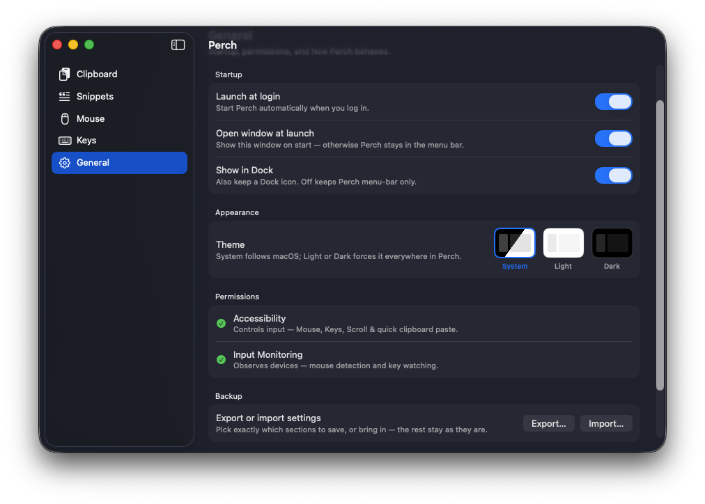

<div align="center">
  
  <h1>Perch</h1>
  <p><b>Clipboard · Snippets · Mouse · Keys — the power-user tools macOS forgot, in one menu-bar app.</b></p>
  <sub>Native macOS · SwiftUI · runs quietly in your menu bar · everything stays on your Mac</sub>
  <br><br>
  <a href="https://perch.kodeelite.com"><b>perch.kodeelite.com</b></a> ·
  <a href="https://github.com/azharbinanwar/perch-releases/releases/latest/download/Perch.dmg">Download</a> ·
  <a href="https://github.com/azharbinanwar/perch-releases/releases">Releases</a>
</div>

```sh
# install (clears the Gatekeeper warning for you)
curl -fsSL perch.kodeelite.com/install.sh | sh

# or with Homebrew
brew install --cask azharbinanwar/tap/perch
```

<br>

<div align="center">
  
  <br>
  <sub>The <code>⇧⌘V</code> clipboard — searchable, categorized, fully keyboard-driven.</sub>
</div>

---

## Why Perch?

macOS is great, but power users end up installing four separate apps: a clipboard manager, a snippet expander, a mouse remapper, and a keyboard tool. Perch is all four — designed to feel like one app, live in your menu bar, and respect your privacy. No accounts, no cloud, no telemetry. Passwords and sensitive copies are never recorded, and everything stays on your Mac.

- **One app, four tools** — Clipboard, Snippets, Mouse, Keys.
- **Menu-bar first** — a Dock icon is optional; it stays out of your way.
- **Per-app aware** — Mouse and Keys can behave differently in each app.
- **Keyboard-driven** — `⇧⌘V` and a private Hyper Key layer put everything a keystroke away.

---

## 📋 Clipboard

A full clipboard history you open with **`⇧⌘V`** (a floating, non-activating popup) or peek at from the menu bar.

<div align="center"></div>

- **History** of text, images, and files, with de-duplication and configurable caps (default **50** in the popup, **10** in the menu peek).
- **Non-activating popup** — the app you're in keeps focus the whole time; `⏎` drops the item straight into it. The hotkey itself is customizable.
- **Categories** — filter by All / Text / Images / Snippets right in the popup (`⇥` cycles them).
- **Pins** — keep your go-to items at the top permanently (default **5**, configurable).
- **Search-as-you-type**, per-item actions (pin, copy, delete), and timestamps.
- **Edit before paste** (`⌘E`) — tweak a clip on the way out without touching the stored copy.
- **Screenshots** — screenshots and screen recordings saved to file are captured into history automatically (toggleable).
- **Restore after paste** — quick-pasting an old item puts your current clipboard back afterwards.
- **Auto-clear** — optionally expire history on a schedule.
- **Privacy** — passwords and sensitive copies are never recorded; exclude any app from recording (or from quick paste) per app.
- **Appearance** — adjustable row density for how roomy each item looks.

<div align="center"></div>

<details>
<summary><b>⌨️ Full keyboard shortcuts</b> (press <code>⌘/</code> in the popup for this cheat-sheet)</summary>

<br>

<div align="center"></div>

| Key | Action | Key | Action |
|-----|--------|-----|--------|
| `↑ ↓` | Move (wraps) | `⌘C` | Copy (no paste) |
| `⇥ / ⇧⇥` | Next / previous category | `⌘P` | Pin / Unpin |
| `⌥1–9` | Jump to category | `⌘O` | Open link |
| `⌘↑ / ⌘↓` | Top / Bottom | `⌘R` | Reveal file in Finder |
| `Space` | Preview (empty search) | `⌘S` | Save image to Downloads |
| `⌘Y` | Preview (always) | `⌘E` | Edit text & paste |
| `↵` | Paste & close | `⌘K` | Clear all |
| `⌘↵` | Paste & keep open | `⌫` | Delete search char |
| `⌘⇧↵` | Paste plain (no formatting) | `⌘/` | All shortcuts |
| `⌘1–9` | Quick paste | `esc` | Close |
| `⌘⌫` | Delete item | | |

</details>

---

## ✂️ Snippets

Saved clips you reuse — always in the clipboard, and expandable by typing a trigger **anywhere**.

<div align="center"></div>

- **Type-to-expand** — type `;meet;` and it's instantly replaced by the snippet. `;` is the default prefix; `:abbr:` and `//abbr//` are available in settings. The *closing* prefix triggers it, so `;a;` and `;ab;` happily coexist.
- **Dynamic placeholders**, resolved as you paste:
  - `{date}` (with a format picker) · `{time}` · `{clipboard}` (your last copy) · `{cursor}` (where the caret lands afterward).
- **Starter snippets** included (Meeting notes, Signature, Quote clipboard, Meeting summary) to teach by example — all editable, never re-seeded after you clear them.
- **Per-app exclusions** — turn expansion off in apps where triggers would collide (editors, terminals).
- Snippets are also a category inside the `⇧⌘V` popup — "Open Snippets" opens it pre-filtered.

---

## 🖱️ Mouse

Turn any mouse into a productivity device — per app or for all apps.

### Buttons & gestures
<div align="center"></div>

- **Scan buttons** to detect every button your mouse has (even extras) — the detected list drives everything else.
- Assign **Click / Double-click / Hold** per button → a shortcut, an action, or a typed keystroke.
- **Keystroke buttons** — some mice have keys that type keyboard combos instead of clicking; Perch captures and maps those too.
- **Gestures** — hold & flick **Up / Down / Left / Right** for four more actions per button.
- **Per-app profiles** — the profile strip on top governs the whole tab; buttons, gestures, scroll and pointer can all differ per app, switching automatically with the frontmost app.
- **Connected mice** readout (via Input Monitoring) so you can see exactly which devices Perch sees.
- **Reliability** — a debounce filter fixes a worn switch that double-fires on one click, without breaking real double-clicks.

### Mouse Shift (a "G-Shift" layer)
<div align="center"></div>

Hold a chosen button (e.g. Middle), then press another button to fire that combo's action — a whole second layer for every button. Each hold key keeps its own independent, unlimited set of combos, and each combo gets its own Click / Double-click / Hold slots. A tap on the hold key alone still performs its normal click actions — nothing is lost.

### Scroll & pointer
<div align="center"></div>

- **Swap primary & secondary buttons** (left-handed mode).
- **Pointer acceleration** override (leaves trackpad untouched).
- **Scroll**: Reverse direction (mouse only), Smooth scrolling (glide on a notchy wheel), No acceleration (flat), Scroll speed, Turbo scroll (hold a key to fly), and Auto-scroll — Windows-style: long-press the trigger button and move to scroll (a quick click still passes through), release to latch and scroll hands-free, any click stops. All per app.

---

## ⌨️ Keys

Remap keys and shortcuts **app by app**, with a private shortcut layer.

<div align="center"></div>

- **Key & shortcut remapping** — e.g. `⌃C → ⌘C`, `⌃V → ⌘V` (Windows muscle memory), or map a combo to **Open App** (e.g. `⇧⌘B → Android Studio`).
- **Smart detect** — dedicated shortcut keys on keyboards send their combo as one instant burst; Perch measures this while you record and can remap **only the hardware key**, so a hand-typed `⌃C` keeps its native meaning (say, Terminal's interrupt) while the copy key on your keyboard still remaps.
- **Per-app profiles** — "All apps" by default, plus custom profiles (e.g. Terminal) that override it.

### Hyper Key & double-tap
<div align="center"></div>

- **Hyper Key** — hold **Caps Lock** to act as `⌘⌥⌃⇧` together: a private shortcut layer no app conflicts with. Single-tap and double-tap get their own actions (e.g. tap → Caps Lock, double-tap → Escape). In apps with a profile that turns it off, Caps Lock stays a real Caps Lock.
- **Double-tap modifiers** — tap a modifier twice quickly to run an action (e.g. double-tap `⇧` → Spotlight) — normal shortcuts are never affected.

---

## ⚡ Actions

Everything a mouse button, gesture, combo, Hyper shortcut or double-tap can trigger comes from one shared catalogue:

| Group | Actions |
|-------|---------|
| **Editing** | Copy · Cut · Paste · Paste as Plain Text · Undo · Redo · Select All · Delete · Find · Save · Emoji & Symbols |
| **Navigation** | Back · Forward · Mission Control · App Exposé · Spotlight · Previous / Next Space |
| **Window** | Minimize · Close · Toggle Full Screen · Snap Left / Right Half · Maximize · Center |
| **App & System** | Quit App · Hide App · Force Quit · Lock Screen |
| **Screenshots** | Area · Window · Full Screen · Screenshot Toolbar |
| **View** | Zoom In · Zoom Out |
| **Media** | Play/Pause · Next / Previous Track · Volume Up / Down · Mute · Brightness Up / Down |
| **Clicks** | Double Click · Triple Click · Middle Click |
| **Perch** | Open Clipboard · Open Snippets · Paste Last · Open Perch |
| **Open** | Any App · Any File · Any URL |
| **Custom & Scripts** | Type any keystroke · Run shell commands · Run AppleScript · Run your Apple Shortcuts — with curated ready-made presets so you don't need to know the syntax |

Window snapping works through Accessibility (no extra window manager needed), and "tryable" actions can be tested right from the picker before you commit.

---

## ⚙️ General

<div align="center"></div>

- **Startup** — Launch at login · Open window at launch · Show in Dock (off = menu-bar only).
- **Appearance** — Theme: System / Light / Dark, applied everywhere in Perch.
- **Permissions** — live status for Accessibility and Input Monitoring.
- **Backup** — export everything to one file; import by dropping it onto Perch, then pick exactly which sections to bring in (with live counts of what would change).
- **Updates** — Perch checks its releases for new versions and can install them itself.
- **Built-in demos** — every non-obvious feature has an ⓘ button that plays a short animated demo of the feature actually working, right inside the app.

---

## Permissions

Perch needs two macOS permissions and asks only when a feature requires them:

| Permission | Why | Without it |
|-----------|-----|-----------|
| **Accessibility** | Controls input | Mouse, Keys, Scroll & quick clipboard paste stop |
| **Input Monitoring** | Observes devices | Mouse detection & key watching stop |

Grant both in **System Settings → Privacy & Security**, then relaunch Perch.

---

## Installation

**Recommended — one line in Terminal** (downloads the latest release, verifies it, installs to Applications, and clears the Gatekeeper warning):

```sh
curl -fsSL perch.kodeelite.com/install.sh | sh
```

**With Homebrew:**

```sh
brew install --cask azharbinanwar/tap/perch
```

**Or manually:**

1. Download the latest [`Perch.dmg`](https://github.com/azharbinanwar/perch-releases/releases/latest/download/Perch.dmg).
2. Open it and drag **Perch** onto **Applications**.
3. Launch Perch from Applications.
4. Grant **Accessibility** and **Input Monitoring** when prompted, then relaunch.

> **First-launch note (Homebrew & manual installs):** Perch isn't notarized yet, so macOS blocks the first launch. Open **System Settings → Privacy & Security**, scroll to *"Perch was blocked"*, and click **Open Anyway** (on macOS 14, right-click → Open also works). One time only. The Terminal installer skips this entirely, and brew users can too with `--no-quarantine`.

---

## Requirements

- macOS 14 (Sonoma) or later
- Apple Silicon

## Privacy

Everything stays on your Mac. Clipboard history is stored locally, passwords and sensitive copies are never recorded, and nothing is sent anywhere.

<div align="center"><br><sub><b>Perch</b> · made for macOS · <a href="https://perch.kodeelite.com">perch.kodeelite.com</a> · by Kode Elite</sub></div>
